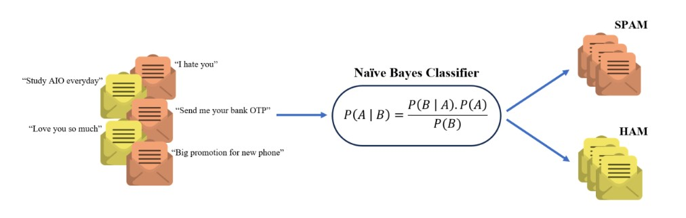

# 📨 Spam or Ham Messages?

Welcome to the **Spam or Ham Classifier** project. This repository is dedicated to building a reliable system that can automatically classify messages as either spam or ham, ensuring your inbox remains clean and efficient.

## 🚀 Project Overview

This project leverages machine learning techniques, specifically the **Naive Bayes** classifier, to detect and filter out spam messages from legitimate ones (ham). The goal is to develop a model that accurately identifies spam messages, helping to prevent unwanted and potentially harmful content from reaching users.

🌟 **Why This Project Matters?**
- **Simple and Effective**: Using a Naive Bayes classifier makes this project accessible while still delivering strong performance.
- **Customizable**: The structure of the project allows for easy modifications and improvements, making it a great starting point for further experimentation.

## 📂 What’s Included

- **Naive Bayes Classifier**: A robust and widely-used probabilistic model, perfect for text classification tasks like spam detection.
  
- **Feature Extraction**: Implementation of a custom Bag of Words technique where each text message is converted into a feature vector based on the frequency of pre-defined dictionary words.
- **Text Preprocessing**: Procedures to clean, tokenize, and prepare the text data for optimal performance of the model.

    
## 🛠️ How to Get Started

1. **Clone the Repository**:
   ```bash
   git clone https://github.com/hannguyen2880/message-classification.git
   cd message-classification
   ```

2. **Run the Jupyter Notebook**: Open the provided Jupyter notebook to explore the model, train it on sample data, and test it with your own messages.

    
